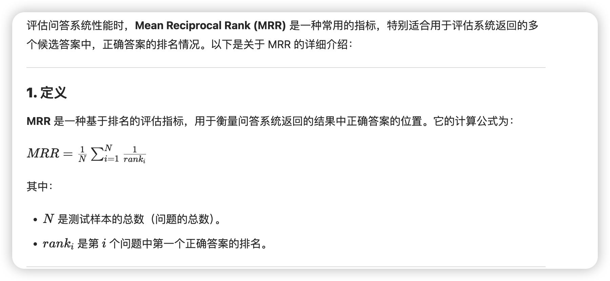

## 介绍
使用 bow 模型，将新闻的内容转换为向量，然后使用milvus进行存储，并进行相似度搜索。

## 一、bert 性能评估
使用 [MRR](https://en.wikipedia.org/wiki/Mean_reciprocal_rank) 性能对比, MRR 的范围是 0-1, 值越大越好。

| 版本 | MRR | 词汇表 | 向量维度 | min_freq | 停用词 | 备注 |
| --- | --- | --- | --- | --- | --- | --- |
| milvus.bow.v9 | 0.0059 | `val.csv` | 768 | - | 否 | - |