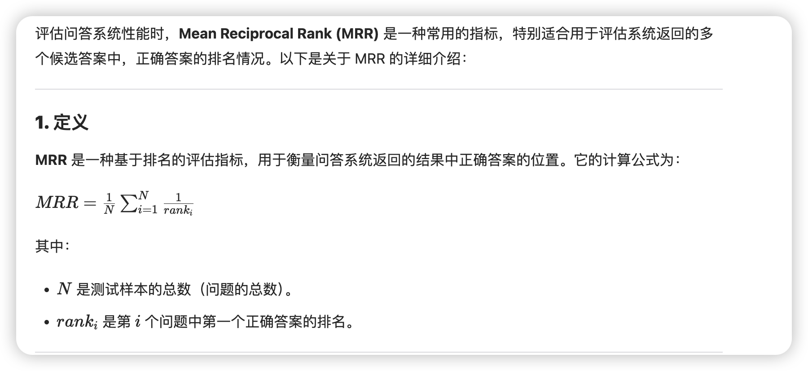

## 介绍
使用 bow 模型，将新闻的内容转换为向量，然后使用milvus进行存储，并进行相似度搜索。

## 一、TF 性能评估
使用 [MRR](https://en.wikipedia.org/wiki/Mean_reciprocal_rank) 性能对比, MRR 的范围是 0-1, 值越大越好。

| 版本 | MRR | 词汇表 | 向量维度 | min_freq | 停用词 | 备注 |
| --- | --- | --- | --- | --- | --- | --- |
| milvus.bow.v1 | 0.0926 | `sohu_data.csv` | 21968 | 1000 | 否 | - |
| milvus.bow.v2 | 0.1674 | `sohu_data.csv` | 21243 | 1000 | 是 | - |
| milvus.bow.v3 | 0.0893 | `val.csv` | 4439 | 1000 | 是 | - |
| milvus.bow.v3_1 | 0.1322 | `val.csv` | 10634 | 350 | 是 | - |
| milvus.bow.v3_2 | 0.1560 | `val.csv` | 16439 | 200 | 是 | - |
| milvus.bow.v3_3 | 0.1560 | `val.csv` | 16439 | 200 | 是 | tf=word_count/total_words_in_curr_doc |

## 二、TF-IDF 性能评估
使用 [MRR](https://en.wikipedia.org/wiki/Mean_reciprocal_rank) 性能对比, MRR 的范围是 0-1, 值越大越好。

| 版本 | MRR | 词汇表 | 向量维度 | min_freq | 停用词 | 备注 |
| --- | --- | ---   | --- | --- | --- | --- |
| milvus.bow.v4 | 0.2219 | `val.csv` | 16439 | 200 | 是 | - |