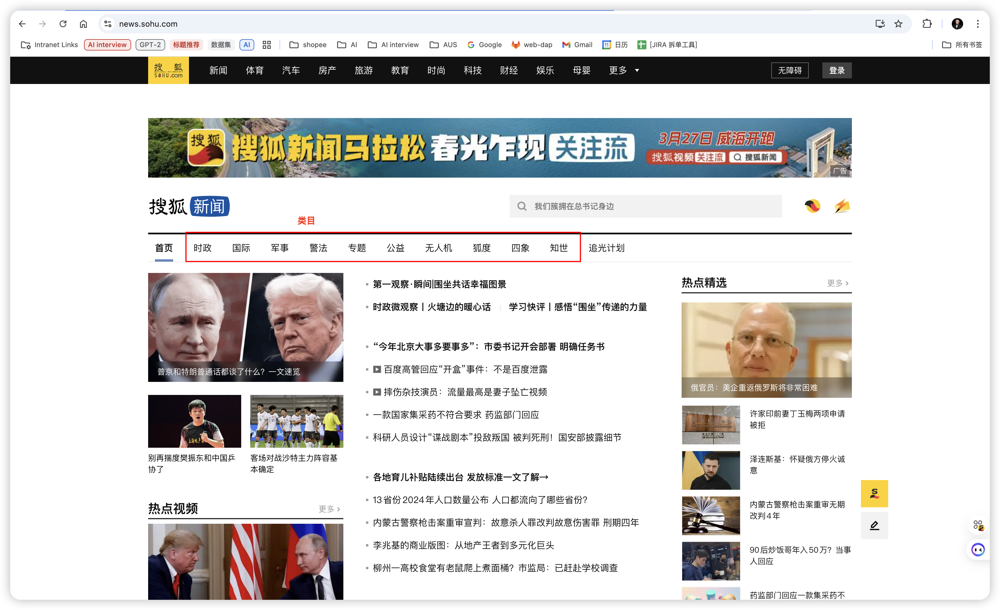
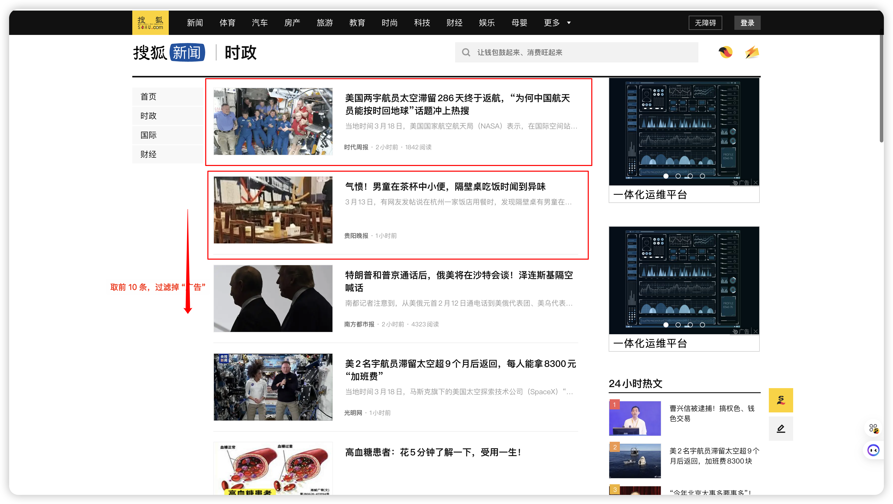
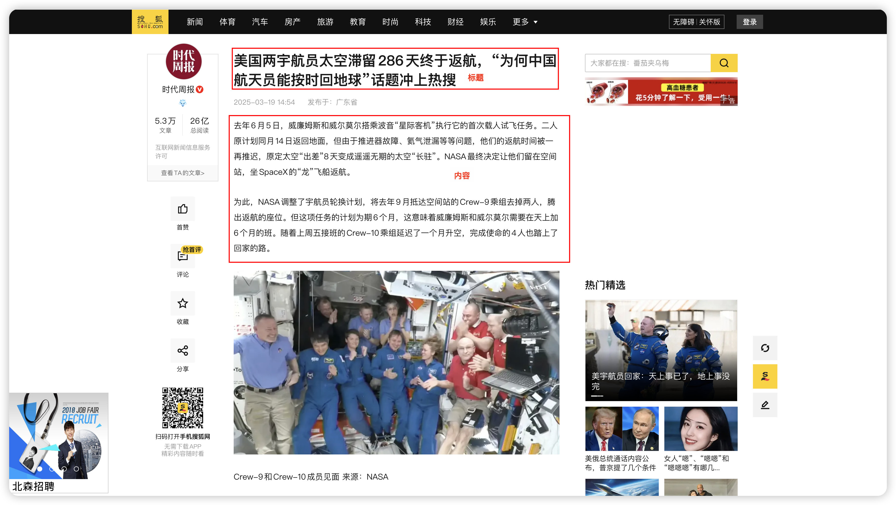

## 介绍

使用 playwright 爬取 [新浪财经新闻](https://news.sohu.com/)，爬取后的新闻语料作为评估不同模型性能的语料。

## 新闻类目
- 时政
- 国际
- 军事
- 警法
- 专题
- 公益
- 无人机
- 狐度
- 四象
- 知世



获取类目 `js` 代码如下
```js
const categoryContainer = document.querySelector('.nav_header');
const nodes = [...categoryContainer.childNodes].slice(1, -3);
const result = nodes
  .filter((node) => node.nodeType == 1)
  .map((node) => node.querySelector("a"))
  .filter((a) => a && a.href)
  .map((a) => ({
    category: a.textContent.trim(),
    url: a.href,
  }))
  .filter(Boolean);

copy(result)
```

## 爬取规则
- 爬取新浪财经新闻的类目
- 爬取类目下前 10 条的新闻标题、链接、内容



```js
() => {
  const selector = [
    '[data-spm-type="resource"]:not(.swiper-slide):not(.TPLImageTextFeedItem)',
    '[data-spm-type="resource"]:not(.swiper-slide)',
  ].find((selector) => document.querySelector(selector));

  if (!selector) {
    return [];
  }

  const result = Array.from(document.querySelectorAll(selector))
    .filter((newContainer) => !newContainer.textContent.includes("广告"))
    .map((node) => node.querySelector("a"))
    .filter((a) => a && a.href)
    .map((a) => a.href);

  const hrefList = new Set([...result].slice(0, 10));

  return Array.from(hrefList);
};
```

## 爬取新闻详情
- 爬取新闻详情页的标题、内容



```js
() => {
  const url = window.location.href;

  const titleDom = document.querySelector(".text-title > h1");
  const title = titleDom ? titleDom.textContent.trim() : "";

  const contentDom = document.querySelector("[data-spm='content'] .article");
  const content = contentDom ? contentDom.textContent.trim() : "";

  return { url, title, content };
};
```


## 结果
最终结果保存在 `result.json` 文件中，格式如下
```json
[
    {
        "category": "时政",
        "url": "https://news.sohu.com/s/20250319/n460966899.shtml",   
        "news_list": [
            {
                "title": "新闻标题",
                "content": "新闻内容",
                "url": "https://news.sohu.com/s/20250319/n460966899.shtml"
            }
        ]
    }
]
```

## 爬虫

```bash
python main.py
```