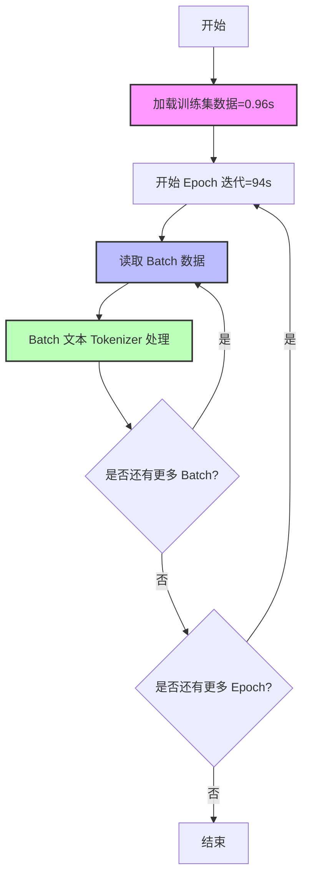

## 说明

- 使用bert-base-uncased作为预训练模型
- 使用adam优化器
- 使用交叉熵损失函数
- 使用准确率作为评估指标
- 使用pytorch框架
- 使用wandb记录训练过程

## 验证项
### 一、每轮 epoch 中，collate_fn 进行 title tokenizer 时，是否会因为重复计算导致速度变慢




5 轮 epoch 中，collate_fn 进行 title tokenizer 的耗时如下。注意，训练时间不包含模型前向传播的耗时。
```txt
训练时间: 93.56 
训练时间: 95.33 
训练时间: 95.15 
训练时间: 94.75                                                      
训练时间: 472.52 秒
```

训练集数据加载的耗时: 0.96 秒
```python
train_dataset = TitleDataset(data_path=f'{data_dir}/train.csv', title_name=config['title_name'],
                                 label_names=config['label_names'])
```