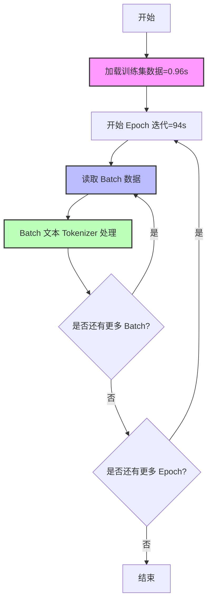
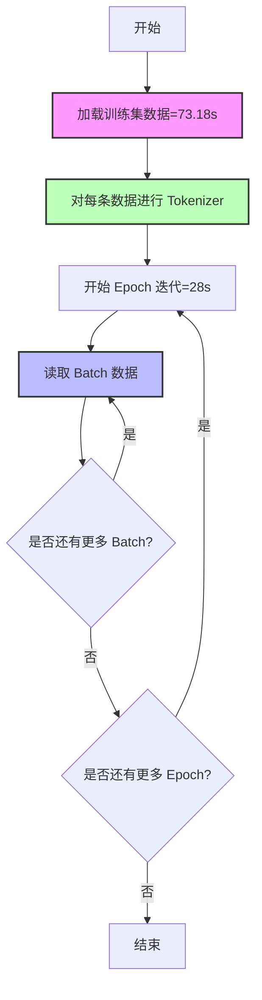
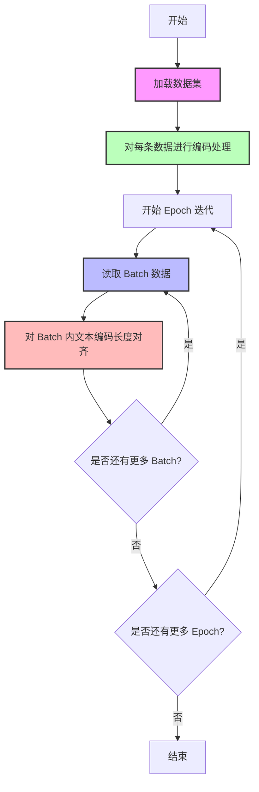

## 说明

- 使用bert-base-uncased作为预训练模型
- 使用adam优化器
- 使用交叉熵损失函数
- 使用准确率作为评估指标
- 使用pytorch框架
- 使用wandb记录训练过程

## 验证项
训练集的数据量: 246980
### 一、每轮 epoch 中，collate_fn 进行 title tokenizer


5 轮 epoch 中，collate_fn 进行 title tokenizer 的耗时如下。注意，训练时间不包含模型前向传播的耗时。
```txt
训练时间: 93.56 
训练时间: 95.33 
训练时间: 95.15 
训练时间: 94.75                                                      
训练时间: 472.52 秒
```

训练集数据加载的耗时: 0.96 秒
```python
train_dataset = TitleDataset(data_path=f'{data_dir}/train.csv', title_name=config['title_name'],
                                 label_names=config['label_names'])
```

### 二、Dataset 加载时，进行 title tokenizer



5 轮 epoch 中，collate_fn 进行 title tokenizer 的耗时如下。注意，训练时间不包含模型前向传播的耗时。
```txt
训练时间: 27.86
训练时间: 29.32
训练时间: 28.32
训练时间: 28.07 
训练时间: 28.36                                             
训练时间: 141.92 秒
```

训练集数据加载的耗时: 73.18 秒
```python
train_dataset = TitleDataset(data_path=f'{data_dir}/train.csv', title_name=config['title_name'],
                                 label_names=config['label_names'])
```

一次性加载所有数据，进行 title tokenizer，需要占用存储空间:
```txt
input_ids: 261.92 MB
attention_mask: 261.92 MB
```

### 三、Dataset 加载时，单独处理每个 title tokenizer

对于方式二，如果不同标题间的长度差异较大，tokenizer 返回的 tensor seq_len 需要对齐，因此会额外占用存储空间。
为了减少内存占用，可以单独处理每个 title tokenizer，然后在 collate_fn 中对齐长度。



5 轮 epoch 中，collate_fn 进行 title tokenizer 的耗时如下。注意，训练时间不包含模型前向传播的耗时。
```txt
训练时间: 27.74
训练时间: 28.62
训练时间: 28.27
训练时间: 27.95
训练时间: 27.67                                           
训练时间: 140.24 秒
```

训练集数据加载的耗时: 74.21 秒
```python
train_dataset = TitleDataset(data_path=f'{data_dir}/train.csv', title_name=config['title_name'],
                                 label_names=config['label_names'])
```

一次性加载所有数据，进行 title tokenizer，需要占用存储空间:
```txt
input_ids: 42.155 MB
attention_mask: 42.155 MB
```

综上，方式三的内存占用较少，训练时间最短